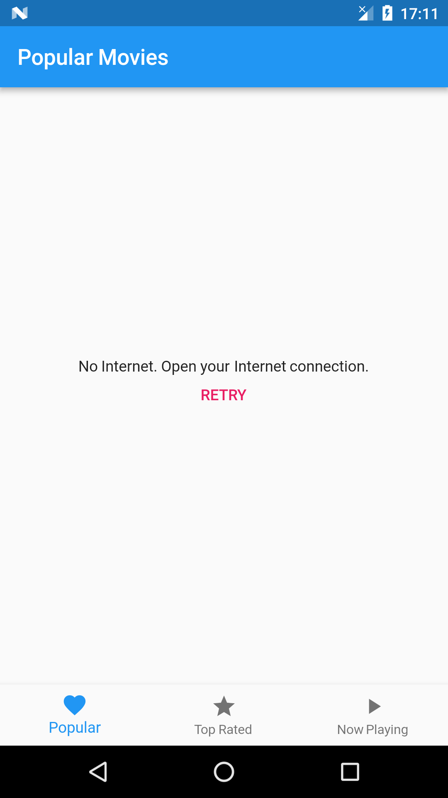

# popular_movies

Display movies in popular, top rated and now playing categories powered
by [Tmdb Api](https://www.themoviedb.org/documentation/api).

* Bloc Pattern (Streams, RxDart, StreamBuilder)

This project is still work in progress. If you have any feedback,
I'll be very happy to get it.

## Configuration
 Get an api key from Tmdb and add it into `api_key.dart` file as following:

 ```const String apiKey = 'your-api-key-here'```;

## Screenshots

Home           |  Movie List Error
:-------------------------:|:-------------------------:
  |  

## To-do

- [ ] InheritedWidget for blocs
- [x] Pagination
- [x] Error Handling
- [x] RefreshIndicator(Pull-to-refresh)


## Credits

[ReactiveX/rxdart github_search example](https://github.com/ReactiveX/rxdart/tree/master/example/flutter/github_search)

[The Boring Flutter Development Show](https://www.youtube.com/watch?v=yr8F2S3Amas&list=PLOU2XLYxmsIK0r_D-zWcmJ1plIcDNnRkK)

[mvi_sealed_unions](https://github.com/brianegan/mvi_sealed_unions)

[giphy_client](https://github.com/brianegan/giphy_client)

[Infitine Dynamic ListView](https://marcinszalek.pl/flutter/infinite-dynamic-listview/)

## Getting Started

For help getting started with Flutter, view our online
[documentation](https://flutter.io/).
