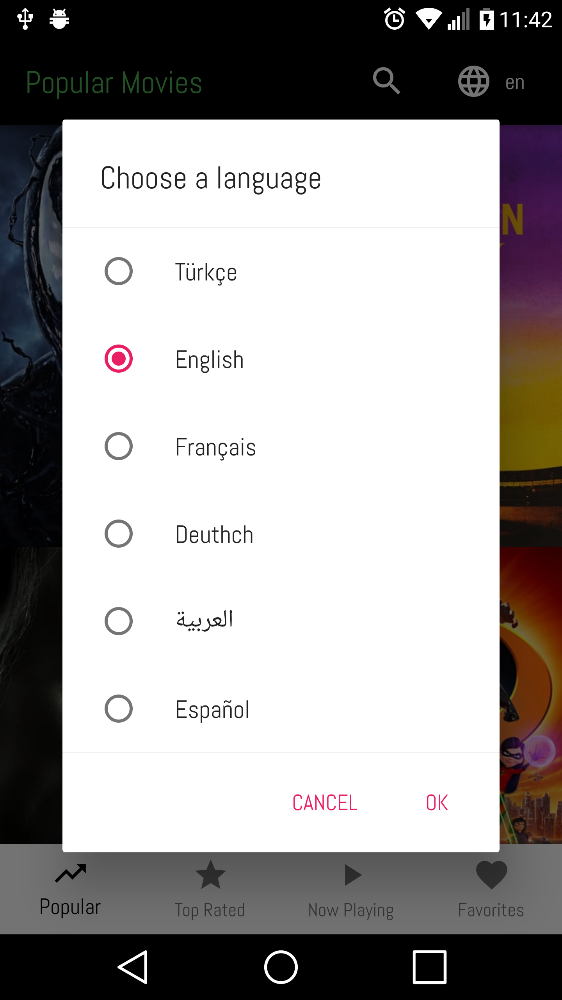
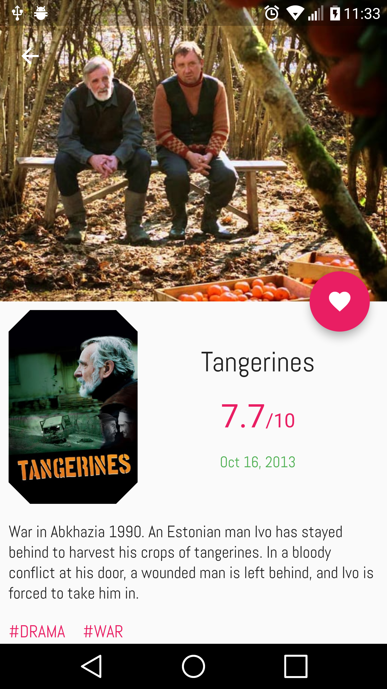

# popular_movies

Display movies in popular, top rated and now playing categories powered
by [Tmdb Api](https://www.themoviedb.org/documentation/api).

* Bloc Pattern (Streams, RxDart, StreamBuilder)

This project is still work in progress. If you have any feedback,
I'll be very happy to get it.

## Configuration
 Get an api key from Tmdb and add it into `api_key.dart` file as following:

 ```const String apiKey = 'your-api-key-here'```;

## Screenshots

Home           |  Language Settings |  Movie Detail
:-------------------------:|:-------------------------:|:-------------------------:
  |   | 

Person Detail    |  Tagged Images|  Error View
:-------------------------:|:-------------------------:|:-------------------------:
 |  | 

## To-do

- [X] InheritedWidget
- [x] Pagination
- [x] Error Handling
- [x] RefreshIndicator(Pull-to-refresh)
- [x] Movie Detail Page
- [x] Favorites Feature
- [x] Person Detail Page
- [x] Tagged Images Page
- [x] Localization('en', 'tr')
- [x] Settings(SharedPreferences)

## Do me a favor

```
flutter pub pub run intl_translation:extract_to_arb --output-dir=lib/l10n lib/l10n/localizations.dart
```

```
flutter pub pub run intl_translation:generate_from_arb --output-dir=lib/l10n --no-use-deferred-loading lib/l10n/intl_en.arb lib/l10n/intl_tr.arb lib/l10n/localizations.dart
```

## Credits

[ReactiveX/rxdart github_search example](https://github.com/ReactiveX/rxdart/tree/master/example/flutter/github_search)

[The Boring Flutter Development Show](https://www.youtube.com/watch?v=yr8F2S3Amas&list=PLOU2XLYxmsIK0r_D-zWcmJ1plIcDNnRkK)

[mvi_sealed_unions](https://github.com/brianegan/mvi_sealed_unions)

[giphy_client](https://github.com/brianegan/giphy_client)

[Infitine Dynamic ListView](https://marcinszalek.pl/flutter/infinite-dynamic-listview/)

[flutter_staggered_grid_view](https://github.com/letsar/flutter_staggered_grid_view)


Instagram Icon made by [Freepik](https://www.flaticon.com/authors/freepik) from www.flaticon.com

Twitter Icon made by [Pixel perfect](https://www.flaticon.com/authors/pixel-perfect) from www.flaticon.com

Facebook Icon made by [Pixel perfect](https://www.flaticon.com/authors/pixel-perfect) from www.flaticon.com

## Getting Started

For help getting started with Flutter, view our online
[documentation](https://flutter.io/).
